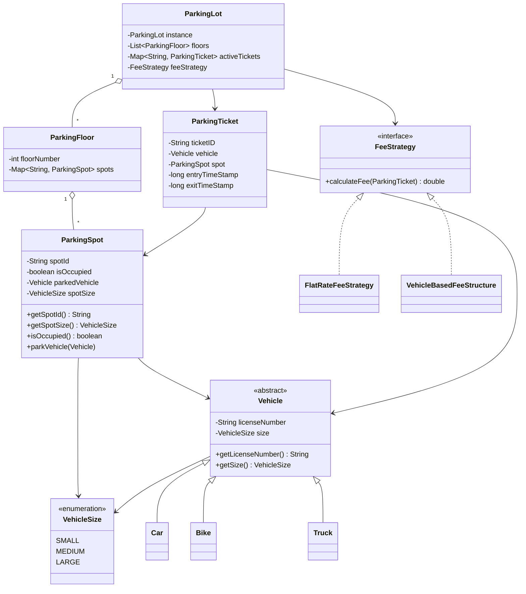
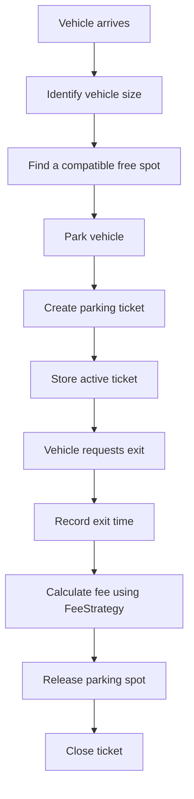

<div align="center">

# System Design

### Java low-level design practice through a Parking Lot system

[](https://github.com/Samee-ul-haq/SystemDesign)
[](https://openjdk.org/)
[](https://github.com/Samee-ul-haq/SystemDesign)
[](https://refactoring.guru/design-patterns/strategy)

**This repository is an incomplete learning project.** It currently explores object-oriented design, vehicle modeling, parking entities, fee strategies, and the early structure of a thread-aware parking lot.

</div>

---

## Overview

This repository is intended for practicing low-level system design in Java. The main design problem is a multi-floor parking lot that can eventually:

1. Accept different vehicle types.
2. Find a compatible parking spot.
3. Issue a ticket when a vehicle enters.
4. Track active parking sessions.
5. Calculate fees using interchangeable pricing strategies.
6. Release the spot when the vehicle exits.

The current code establishes several domain objects and design relationships, but the complete entry-to-exit workflow is not implemented yet.

## Design overview



## Intended parking flow

The diagram below represents the target workflow. The orchestration methods inside `ParkingLot` are still to be implemented.



## Current implementation status

| Component | Status | Current responsibility |
|---|---|---|
| `Vehicle` | Implemented | Abstract base containing license number and vehicle size |
| `Car`, `Bike`, `Truck` | Implemented | Map vehicle types to medium, small, and large sizes |
| `VehicleSize` | Implemented | Defines the supported size categories |
| `FeeStrategy` | Implemented | Provides the pricing-strategy contract |
| `FlatRateFeeStrategy` | Implemented with edge case | Charges a fixed hourly amount |
| `VehicleBasedFeeStructure` | Implemented with edge case | Uses a different hourly rate for each vehicle size |
| `ParkingSpot` | Partial | Stores spot state and parks a vehicle, but cannot release one |
| `ParkingFloor` | Skeleton | Stores a floor number and a concurrent spot map |
| `ParkingTicket` | Does not compile | Models entry/exit data, but its final exit timestamp is assigned incorrectly |
| `ParkingLot` | Skeleton | Declares singleton state, floors, active tickets, and fee strategy |
| `Main.java` | Separate demo | Demonstrates a basic unrelated `Car` class |
| Automated tests | Not present | No unit or integration tests have been added |

## Design concepts demonstrated

### Strategy pattern

`FeeStrategy` separates fee calculation from the parking-lot workflow. The system can switch between pricing rules without changing the ticket or vehicle classes.

```java
public interface FeeStrategy {
    double calculateFee(ParkingTicket parkingTicket);
}
```

The repository currently provides:

- `FlatRateFeeStrategy`: one hourly rate for every vehicle.
- `VehicleBasedFeeStructure`: rates based on small, medium, or large vehicle size.

### Inheritance and polymorphism

`Vehicle` contains shared vehicle state. `Bike`, `Car`, and `Truck` specialize it by selecting the correct `VehicleSize`.

### Singleton intent

`ParkingLot` declares a static instance, indicating that the system is intended to expose one shared parking-lot object. The private constructor and instance-access method are not implemented yet.

### Composition

A parking lot contains floors, a floor contains spots, and each active ticket connects a vehicle to its assigned spot.

### Concurrency foundations

`ParkingFloor` uses `ConcurrentHashMap`, the parking lot imports the same concurrent collection, and spot operations are synchronized. Atomic allocation across multiple spots has not yet been implemented.

## Repository structure

```text
SystemDesign/
|-- ParkingLotProblem/
|   +-- parkinglot/
|       |-- ParkingLot.java
|       |-- class/
|       |   +-- Main.java
|       |-- entities/
|       |   |-- ParkingFloor.java
|       |   |-- ParkingSpot.java
|       |   +-- ParkingTicket.java
|       |-- strategy/
|       |   +-- fee/
|       |       |-- FeeStrategy.java
|       |       |-- FlatRateFeeStrategy.java
|       |       +-- VehicleBasedFeeStructure.java
|       +-- vehicle/
|           |-- Vehicle.java
|           |-- VehicleSize.java
|           |-- Bike.java
|           |-- Car.java
|           +-- Truck.java
+-- README.md
```

## Getting started

### Prerequisites

- JDK 11 or newer
- Git

JDK 17 or newer is recommended for development.

### Clone the repository

```bash
git clone https://github.com/Samee-ul-haq/SystemDesign.git
cd SystemDesign
```

### Run the current standalone demo

The only runnable entry point at present is the basic `Main.java` demonstration:

```bash
cd ParkingLotProblem/parkinglot/class
javac Main.java
java Main
```

Expected output:

```text
Toyota is running at 20 km/h.
-----------------
Ford is running at 40 km/h.
```

> [!WARNING]
> The standalone demo defines its own `Car` class and is not connected to the parking-lot vehicle hierarchy.

### Compile the complete parking-lot source

After correcting the `ParkingTicket` exit-timestamp issue described below, the package can be compiled from the repository root:

```bash
mkdir -p out
find ParkingLotProblem -name "*.java" -print0 | xargs -0 javac -d out
```

There is not yet a parking-lot application entry point to run after compilation.

## Known issues

### 1. The exit timestamp prevents compilation

`ParkingTicket.exitTimeStamp` is declared `final`, is not initialized in the constructor, and is later assigned inside `setExitTimestamp()`. A final field cannot be assigned this way.

The design should either:

- Make the exit timestamp mutable, because it becomes known only when the vehicle exits, or
- Create a separate immutable completed-ticket representation.

### 2. Occupancy reporting is inverted

`ParkingSpot.isOccupied()` currently returns `!isOccupied`. A method with this name should return the stored occupancy state directly.

### 3. A parked vehicle cannot leave

`ParkingSpot` has `parkVehicle()` but no method that clears `parkedVehicle` and resets the occupancy flag.

### 4. Spot compatibility is not enforced

`parkVehicle()` does not validate whether a vehicle fits the spot. The project needs a clear policy, such as:

- Small vehicles can use small, medium, or large spots.
- Medium vehicles can use medium or large spots.
- Large vehicles can use only large spots.

### 5. Exact-hour parking is overcharged

Both fee strategies calculate hours using integer division followed by `+1`. A stay of exactly one hour is therefore billed as two hours. The calculation should use a proper ceiling operation while preserving the chosen minimum charge.

### 6. The main parking-lot service is incomplete

`ParkingLot` still needs:

- Singleton construction and access
- Floor and spot registration
- Spot allocation
- Ticket creation and lookup
- Vehicle exit handling
- Fee calculation
- Spot release
- Capacity queries

### 7. Generated class files are committed

The repository currently contains `.class` files. Generated build output should normally be removed from version control and excluded with:

```gitignore
*.class
out/
```

## Suggested roadmap

- [x] Create the vehicle hierarchy
- [x] Model vehicle-size categories
- [x] Define the fee-strategy interface
- [x] Add flat-rate and vehicle-based fee strategies
- [x] Model parking spots, floors, and tickets
- [ ] Fix the current compilation and occupancy issues
- [ ] Add park and unpark operations to `ParkingSpot`
- [ ] Implement the `ParkingLot` singleton safely
- [ ] Add a spot-allocation strategy
- [ ] Implement ticket issue and vehicle exit workflows
- [ ] Add entry and exit gates
- [ ] Add payment methods and payment status
- [ ] Add display boards for available capacity
- [ ] Add domain exceptions and input validation
- [ ] Add JUnit tests for fees, allocation, and concurrency
- [ ] Add Maven or Gradle
- [ ] Add a complete parking-lot demonstration

## Possible future design

The project can remain extensible by adding these abstractions:

| Extension | Possible interface or class |
|---|---|
| Spot selection | `ParkingSpotAllocationStrategy` |
| Payment | `PaymentStrategy` and `Payment` |
| Gates | `EntryGate` and `ExitGate` |
| Availability | `DisplayBoard` |
| Persistence | `TicketRepository` and `ParkingLotRepository` |
| Time control for tests | `Clock` injection |
| Domain failures | `NoSpotAvailableException` and `InvalidTicketException` |

## Contributing

This repository is a learning project, so small and focused improvements are welcome:

1. Create a branch for one design improvement.
2. Keep domain rules explicit.
3. Add tests for the behavior you introduce.
4. Avoid committing generated `.class` files.
5. Open a pull request explaining the design decision.

## Author

Developed by **[Samee-ul-haq](https://github.com/Samee-ul-haq)**.
